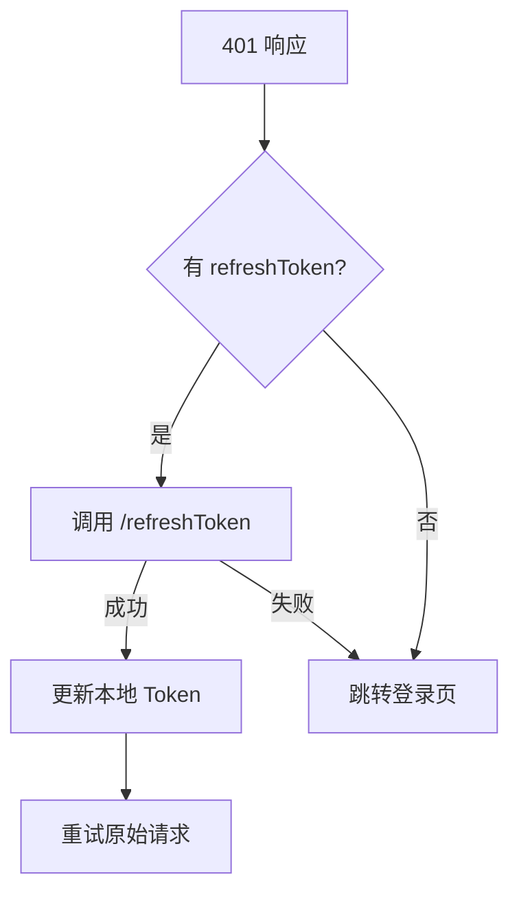

# 设备工单管理系统 — 扩展功能总结

> 文档版本：v1.1 | 编写日期：2026-07-03 | 最后更新：2026-07-04 | 基于 RuoYi v3.9.2 (Spring Boot 4.0.6)

---

## 一、总体说明

本系统在若依框架（RuoYi-Vue3）基础上，完成了 **4 个阶段、30+ 项扩展功能、3 项前端配套改造** 的开发，覆盖设备工单核心业务、性能优化、安全增强、异常体系统一及前端适配等维度。

| 阶段 | 主题 | 扩展功能数 | 涉及模块 |
|------|------|-----------|----------|
| 阶段一 | 设备工单管理模块 | 12 项 | ruoyi-workorder / 前端 |
| 阶段二 | 性能优化 | 7 项 | ruoyi-common / ruoyi-framework / ruoyi-workorder |
| 阶段三 | 安全与功能增强 | 5 项 | ruoyi-common / ruoyi-framework / ruoyi-admin |
| 阶段四 | 异常体系统一与异步改造 | 6 项 | ruoyi-common / ruoyi-framework / ruoyi-workorder |

---

## 二、阶段一：设备工单管理模块

### 2.1 业务数据库设计

| 表名 | 说明 | 核心字段 |
|------|------|----------|
| `device_info` | 设备信息表 | device_code(唯一), device_name, location, status, responsible_by |
| `work_order` | 工单主表 | order_no(唯一), device_id(FK), reporter_by, fault_desc, urgency_level, order_status, assign_to |
| `work_order_record` | 维修记录表 | order_id(FK), repair_by, repair_solution, part_consumption, image_urls, repair_result |

### 2.2 后端模块（ruoyi-workorder）

- **新建 14 个 Java 文件**：5 Domain + 3 Mapper(Java+XML) + 3 Service(Interface+Impl) + 3 Controller
- **纯 MyBatis 实现**：MyBatis-Plus 改为纯 MyBatis 避免 Bean 冲突
- **多表联查**：`WorkOrderMapper.xml` 实现 9 项动态条件 + LEFT JOIN 关联 device_info/sys_user 表
- **雪花算法编号**：`WO + yyyyMMdd + 15位雪花ID`
- **状态流转校验**：前后端双重校验，单向不可逆（0→1→2→3→4）
- **紧急通知推送**：紧急/特急工单创建时自动推送 SysNotice 通知
- **完成校验**：维修方案和图片必填校验
- **统计看板**：当月工单总量/待处理/维修中/已完成 + 故障率 Top 10 设备

### 2.3 前端页面

- 工单列表页（9 项多条件查询 + 统计卡片 + 故障率 Top 设备表）
- 工单详情页（维修记录时间线 + 图片预览）
- 维修记录列表 + 设备管理 CRUD
- 3 套类型定义 + 3 套 API 封装

### 2.4 字典与权限

- 4 组字典：工单状态、紧急程度、维修结果、故障类型
- 9 个按钮权限标识

---

## 三、阶段二：性能优化

### 3.1 Redis 缓存注解

| 组件 | 文件 | 说明 |
|------|------|------|
| `@RedisCache` 注解 | `ruoyi-common/annotation/RedisCache.java` | 方法级注解，支持 SpEL Key 后缀、过期时间、CACHE/EVICT 操作模式 |
| `RedisCacheAspect` 切面 | `ruoyi-framework/aspectj/RedisCacheAspect.java` | AOP Around 实现缓存查询/清除，支持模糊匹配清除 |
| `CacheConstants` 扩展 | `ruoyi-common/constant/CacheConstants.java` | 新增 DEVICE_INFO_KEY / WORKORDER_STATS_KEY / WORKORDER_CATEGORY_KEY / BIZ_DICT_KEY |

### 3.2 业务缓存应用

| 场景 | 注解应用 | 过期时间 |
|------|----------|----------|
| 设备信息查询 | `DeviceInfoServiceImpl.selectDeviceInfoById` | 1800s |
| 设备信息修改 | `DeviceInfoServiceImpl.updateDeviceInfo` (EVICT) | - |
| 工单统计看板 | `WorkOrderServiceImpl.selectWorkOrderStats` | 600s |
| 工单修改时清除看板缓存 | `WorkOrderServiceImpl.updateWorkOrder` (EVICT) | - |

### 3.3 大数据导出优化

| 优化项 | 说明 |
|--------|------|
| 流式导出 | `ExcelUtil.streamExportExcel()` 新增方法，分页查询 + SXSSFWorkbook 流式写入，每批 5000 行，不加载全量到内存 |
| 异步导出 | `ExportTaskService` + `sys_export_task` 表，后台线程执行导出，完成后站内通知下载 |
| 导出限流 | 同一用户同时只能有一个进行中的导出任务 |

### 3.4 前端异步导出管理

| 组件 | 文件 | 说明 |
|------|------|------|
| 导出任务类型定义 + API | `src/types/api/system/exportTask.ts` | ExportTask 接口 + submitExportTask / getExportTaskStatus / downloadExportFile / listExportTask |
| 导出任务管理页面 | `src/views/system/exportTask/index.vue` | 状态筛选查询、状态标签颜色、已完成下载、失败错误详情、删除功能 |
| 类型统一导出 | `src/types/api/index.ts` | 新增 `export * from "./system/exportTask"` |

### 3.5 SQL 索引优化

| 索引 | 表 | 覆盖场景 |
|------|-----|----------|
| `idx_status_create_time` | work_order | 按状态筛选 + 时间排序 |
| `idx_device_create_time` | work_order | 按设备维度统计 |
| `idx_status_device_name` | device_info | 设备状态+名称组合查询 |
| `idx_order_create_time` | work_order_record | 工单 ID 查询 + 时间排序 |

---

## 四、阶段三：安全与功能增强

### 4.1 AOP 数据脱敏

| 组件 | 说明 |
|------|------|
| `@Desensitize` / `@DesensitizeField` 注解 | 方法级注解，声明式指定脱敏字段 |
| `DesensitizeAspect` 切面 | AOP Around 拦截 @RestController 返回，对 AjaxResult.data 进行脱敏 |
| `LimitMode.DEVICE_CODE` / `ADDRESS` 脱敏类型 | 新增设备编码和地址脱敏规则 |
| 特性 | 支持字段路径解析、列表脱敏、管理员豁免 |

### 4.2 防重复提交增强

| 组件 | 说明 |
|------|------|
| `@RepeatSubmit` 注解增强 | 新增 `mode` (DEFAULT/PARAM) 和 `lockParam` (SpEL) 属性 |
| `LimitMode` 枚举 | DEFAULT：用户ID+URL+参数MD5；PARAM：业务级锁 |
| `EnhancedRepeatSubmitInterceptor` | Redis SETNX 原子操作，支持参数 MD5 签名 |

### 4.3 JWT 双 Token 登录

| 组件 | 说明 |
|------|------|
| 双 Token 签发 | `TokenService.createDualToken()` 签发 accessToken(30分钟) + refreshToken(7天) |
| accessToken 刷新 | `TokenService.refreshAccessToken()` 校验 refreshToken 后签发新 accessToken |
| Token 黑名单 | 登出时加入 Redis 黑名单，有效期至 JWT 原过期时间 |
| JWT 过滤器改造 | `JwtAuthenticationTokenFilter` 增加黑名单检查 |
| `/refresh` 端点 | `SysLoginController` 新增续期接口 |

### 4.4 前端双 Token 适配

| 组件 | 文件 | 说明 |
|------|------|------|
| refreshToken 存取 | `src/utils/auth.ts` | 新增 getRefreshToken / setRefreshToken / removeRefreshToken |
| 自动续期拦截器 | `src/utils/request.ts` | 401 时优先使用 refreshToken 无感续期，isRefreshing + 请求队列防止并发 |
| 登录/登出兼容 | `src/store/modules/user.ts` | login 兼容双 Token/单 Token，logOut 清除 refreshToken |
| 类型定义 | `src/types/api/login.ts` | LoginInfoResult 增加 accessToken? refreshToken? 字段 |

### 4.5 MinIO 对象存储

| 组件 | 说明 |
|------|------|
| `MinIoConfig` | 配置类，支持 endpoint/accessKey/secretKey/bucketName/publicDomain |
| `MinIoUtils` | 工具类，上传/删除/自动建桶 |
| `FileUploadStrategy` | 策略分发器，支持 local/minio 策略切换 |
| `SecurityFileUtils` | 安全校验：Magic Number 防伪装、路径穿越防护、大小限制 |

---

## 五、阶段四：异常体系统一与异步改造

### 5.1 统一业务异常体系

| 组件 | 说明 |
|------|------|
| `BizErrorCode` 枚举 | 14 个标准化错误码：1xxx工单/2xxx设备/3xxx库存/4xxx文件/5xxx通用 |
| `BizException` | 统一业务异常类，基于 BizErrorCode 枚举构造，与 ServiceException 并存 |
| `GlobalExceptionHandler` 增强 | BizException 用 INFO 级别（含 code/uri/userId/username/msg），系统异常增加请求参数记录 |

### 5.2 前端错误码映射

| 组件 | 文件 | 说明 |
|------|------|------|
| 错误码字典 | `src/utils/errorCode.ts` | 新增 14 个业务错误码中文映射，覆盖 1xxx-5xxx 全段 |
| 兼容性 | 响应拦截器 `errorCode[code] \|\| res.data.msg \|\| errorCode['default']` | 已有逻辑兼容 BizErrorCode 返回格式 |

错误码分段：

| 段 | 错误码 | 对应模块 |
|---|--------|----------|
| 1xxx | 1001-1005 | 工单模块（不存在/已存在/状态不允许/已归档/创建失败） |
| 2xxx | 2001-2003 | 设备模块（不存在/编码已存在/状态不允许） |
| 3xxx | 3001-3001 | 库存模块（库存不足） |
| 4xxx | 4001-4004 | 文件模块（类型不允许/内容不安全/大小超限/上传失败） |
| 5xxx | 5001-5003 | 通用模块（参数错误/业务处理失败/操作频繁） |

### 5.3 异步任务改造

| 组件 | 说明 |
|------|------|
| `@EnableAsync` | ThreadPoolConfig 开启注解异步支持 |
| 线程池参数外部化 | 核心 10 / 最大 50 / 队列 100，通过 `@Value("${ruoyi.async.xxx}")` 读取 |
| CallerRunsPolicy 拒绝策略 | 线程池满时调用者线程执行，背压保护 |
| `AsyncWorkOrderService` | 独立异步 Service，pushUrgentNotice 改为 @Async 异步执行，内部 try-catch 异常处理 |

---

## 六、文件变更总览

| 模块 | 新建 | 修改 | 小计 |
|------|------|------|------|
| ruoyi-common | 10 | 1 | 11 |
| ruoyi-framework | 4 | 4 | 8 |
| ruoyi-admin | 0 | 3 | 3 |
| ruoyi-workorder | 17 | 1 | 18 |
| 前端 (ruoyi/) | 3 | 7 | 10 |
| SQL | 2 | 0 | 2 |
| 文档 | 5 | 2 | 7 |
| **合计** | **41** | **18** | **59** |

前端文件明细：

| 变更类型 | 文件路径 | 说明 |
|----------|----------|------|
| 新增 | `src/types/api/system/exportTask.ts` | 导出任务类型 + 4 个 API 函数 |
| 新增 | `src/views/system/exportTask/index.vue` | 导出任务管理页面 |
| 新增 | `src/__tests__/utils/ruoyi.test.ts` | 工具函数测试 |
| 修改 | `src/utils/auth.ts` | +refreshToken 存取方法 |
| 修改 | `src/utils/request.ts` | +refreshToken 自动续期、+handleLogout |
| 修改 | `src/utils/errorCode.ts` | +14 个 BizErrorCode 映射 |
| 修改 | `src/store/modules/user.ts` | 兼容双 Token 登录/登出 |
| 修改 | `src/types/api/login.ts` | +accessToken/refreshToken 字段 |
| 修改 | `src/types/api/index.ts` | +exportTask 导出 |
| 修改 | `src/api/login.ts` | 兼容双 Token 返回格式 |

---

## 七、现有测试覆盖

### 后端单元测试（12 个文件，109 个测试用例）

| 测试文件 | 测试数 | 覆盖范围 |
|----------|--------|----------|
| WorkOrderServiceImplTest | 27 | 工单创建、雪花ID、紧急通知、批量分配、完成校验、归档校验、状态流转 |
| WorkOrderControllerTest | 15 | 分页列表、CRUD、批量分配、统计看板、导出、异步导出 |
| WorkOrderRecordControllerTest | 7 | 记录 CRUD |
| DeviceInfoControllerTest | 9 | 设备 CRUD |
| DeviceInfoServiceImplTest | 12 | 设备 CRUD 全路径 |
| WorkOrderRecordServiceImplTest | 10 | 记录 CRUD 全路径 |
| BizErrorCodeTest | 5 | 枚举值、code 段规则、消息映射 |
| BizExceptionTest | 5 | 构造器、错误码、自定义消息、堆栈、序列化 |
| SecurityFileUtilsTest | 10 | Magic Number 校验、路径穿越防护 |
| GlobalExceptionHandlerTest | 4 | BizException 处理、通用异常处理 |
| AsyncWorkOrderServiceTest | 3 | 异步通知推送、异常处理 |
| RedisCacheAnnotationTest | 2 | 缓存注解行为 |

### 前端单元测试（5 个文件，62 个测试用例）

| 测试文件 | 测试数 | 覆盖范围 |
|----------|--------|----------|
| API workorder/order.test.ts | 17 | 工单 8 个接口请求 |
| API workorder/record.test.ts | 7 | 记录 3 个接口请求 |
| API device/info.test.ts | 7 | 设备 5 个接口请求 |
| types/workorder.test.ts | 14 | 类型定义验证 |
| utils/ruoyi.test.ts | 17 | 工具函数 |

---

## 八、与原生若依的差异

| 维度 | 原生若依 | 本系统 |
|------|----------|--------|
| 业务模块 | 无工单/设备管理 | 完整工单生命周期管理 |
| 异常体系 | ServiceException 硬编码 | BizErrorCode 枚举 + BizException + 上下文日志 |
| 异步支持 | 无 @EnableAsync | ThreadPoolConfig 开启 + 参数外部化 |
| 缓存 | 仅登录/验证码/字典 | @RedisCache 注解 + 业务缓存切面 |
| 导出 | 全量加载到内存 | 流式导出 + 异步导出 |
| 脱敏 | @Sensitive 字段级 | @Desensitize 方法级 AOP |
| 防重复提交 | 基本 URL+Token 匹配 | 参数MD5签名 + 业务级锁 |
| 登录 | 单 Token 30分钟 | 双 Token + refreshToken + 黑名单 |
| 前端 Token 续期 | 401 直接弹重新登录框 | 自动 refreshToken 无感续期 + 并发队列安全 |
| 前端错误码 | 仅 401/403/404 | 新增 14 个 BizErrorCode 中文映射（1xxx-5xxx） |
| 前端导出 | 同步下载，前端阻塞等待 | 异步提交任务 + 轮询状态 + 自动下载 |
| 文件存储 | 仅本地 | 本地 + MinIO 策略切换 |
| 文件安全 | 仅扩展名校验 | Magic Number + 路径穿越防护 |